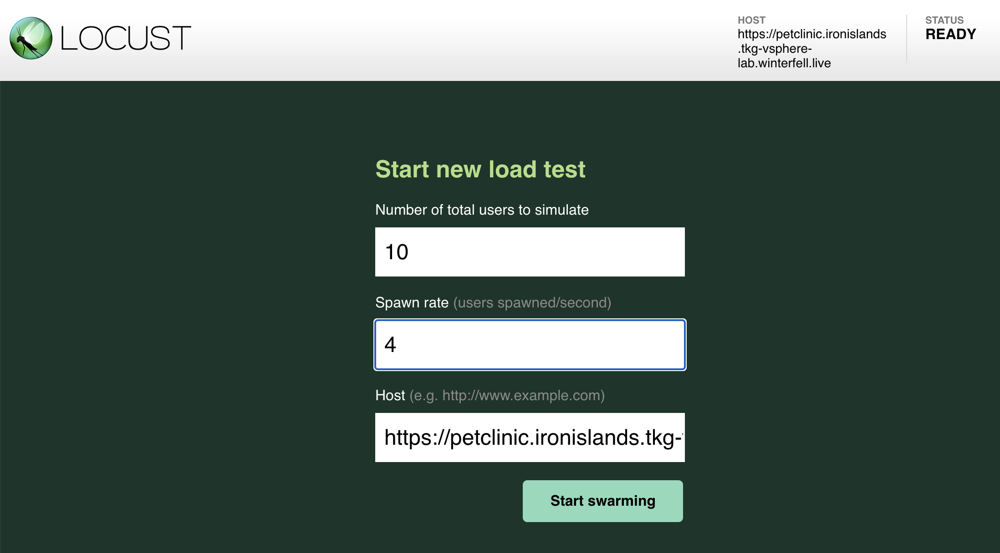
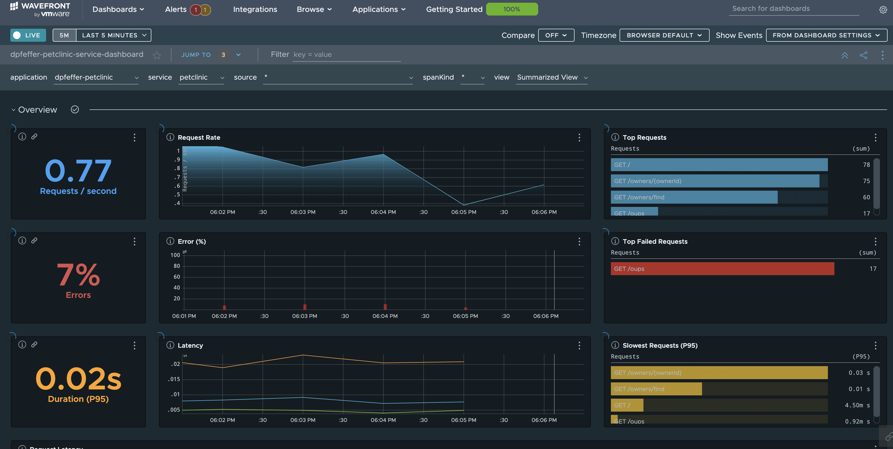

# Setup Load Generation for More Interesting Dashboards

The following approach was borrowed by the TSM demo which uses [acme-fitness](https://github.com/vmwarecloudadvocacy/acme_fitness_demo/tree/master/traffic-generator).

# Requirements

1. Local docker daemon

2. Spring Pet Clinic

# Steps

1. Set environment variables for use in the following sections

```bash
export PETCLINIC_HOST=$(yq r $PARAMS_YAML petclinic.host)
```

2. Run locust via docker

```bash
docker run -p 8089:8089 -v $PWD:/mnt/locust locustio/locust -f /mnt/locust/traffic-generator/locustfile.py -H https://$PETCLINIC_HOST
```

3. Access Locus UI

```bash
open http://localhost:8089
```

4. Click on 'New Test' and provide the number of users to simulate.   I used 10 users with hatch rate 4




5. Check out your nice data flowing through on your custom TO dashboard


